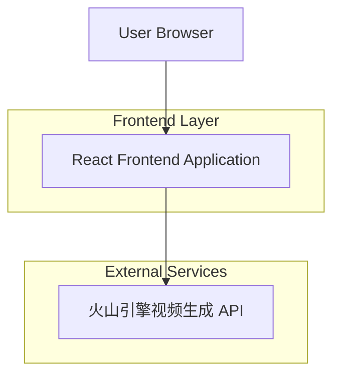

## 1.Architecture design



## 2.Technology Description

- Frontend: React@18 + tailwindcss@3 + vite
- Initialization Tool: vite-init
- Backend: None (直接调用火山引擎 API)
- API Client: 使用 fetch 直接调用火山引擎 REST API

## 3.Route definitions

| Route | Purpose |
|-------|---------|
| / | 视频生成页面，主功能入口 |
| /status/:taskId | 任务状态页面，显示指定任务的进度和结果 |

## 4.API definitions

### 4.1 Core API

视频生成任务创建
```
POST https://ark.cn-beijing.volces.com/api/v3/contents/generations/tasks
```

Request:
| Param Name | Param Type | isRequired | Description |
|------------|------------|------------|-------------|
| model | string | true | 模型名称，如 doubao-seedance-2-0-260128 |
| content | array | true | 内容数组，包含 text/image_url/video_url/audio_url |
| generate_audio | boolean | false | 是否生成音频 |
| ratio | string | false | 视频比例，16:9/9:16/1:1 |
| duration | number | false | 视频时长(秒) |
| watermark | boolean | false | 是否添加水印 |

Response:
| Param Name | Param Type | Description |
|------------|------------|-------------|
| id | string | 任务ID |
| status | string | 任务状态 pending/processing/succeeded/failed |
| created_at | string | 创建时间 |

任务状态查询
```
GET https://ark.cn-beijing.volces.com/api/v3/contents/generations/tasks/{taskId}
```

Response:
| Param Name | Param Type | Description |
|------------|------------|-------------|
| id | string | 任务ID |
| status | string | 任务状态 |
| content | object | 包含 video_url 等结果信息 |

### 4.2 TypeScript Types

```typescript
// 内容项类型
interface ContentItem {
  type: 'text' | 'image_url' | 'video_url' | 'audio_url';
  text?: string;
  image_url?: { url: string };
  video_url?: { url: string };
  audio_url?: { url: string };
  role?: 'reference_image' | 'reference_video' | 'reference_audio';
}

// 视频生成请求
interface VideoGenerationRequest {
  model: string;
  content: ContentItem[];
  generate_audio?: boolean;
  ratio?: '16:9' | '9:16' | '1:1';
  duration?: number;
  watermark?: boolean;
}

// 任务响应
interface TaskResponse {
  id: string;
  status: 'pending' | 'processing' | 'succeeded' | 'failed';
  created_at?: string;
  content?: {
    video_url?: string;
    [key: string]: any;
  };
  error?: {
    code: string;
    message: string;
  };
}

// 上传文件信息
interface UploadedFile {
  id: string;
  file: File;
  previewUrl: string;
  type: 'image' | 'video' | 'audio';
}

// 生成参数
interface GenerationParams {
  prompt: string;
  images: UploadedFile[];
  video: UploadedFile | null;
  audio: UploadedFile | null;
  ratio: '16:9' | '9:16' | '1:1';
  duration: number;
  generateAudio: boolean;
}
```

## 5.Data model

### 5.1 Local Storage Schema

应用使用 localStorage 存储临时数据：

```typescript
// 存储键名
const STORAGE_KEYS = {
  API_KEY: 'volcengine_api_key',  // 用户输入的 API Key
  LAST_PARAMS: 'last_generation_params',  // 上次使用的生成参数
  TASK_HISTORY: 'task_history',  // 任务历史记录
};

// 任务历史记录项
interface TaskHistoryItem {
  taskId: string;
  createdAt: string;
  prompt: string;
  status: string;
  videoUrl?: string;
}
```

## 6.File Upload Strategy

由于火山引擎 API 需要传入文件的 URL，前端采用以下策略：

1. 用户选择本地文件
2. 前端将文件转换为 Base64 Data URL
3. 在调用 API 时直接使用 Data URL 作为文件内容
4. 或使用第三方图床/文件托管服务获取公开 URL

考虑到简单性，第一阶段使用 Data URL 方式：

```typescript
// 文件转 Base64
const fileToBase64 = (file: File): Promise<string> => {
  return new Promise((resolve, reject) => {
    const reader = new FileReader();
    reader.readAsDataURL(file);
    reader.onload = () => resolve(reader.result as string);
    reader.onerror = reject;
  });
};
```

## 7.Environment Configuration

项目使用 .env 文件存储配置：

```
# .env
VITE_VOLCENGINE_API_KEY=your_api_key_here
```

注意：实际开发中 API Key 由用户在界面输入并存储在 localStorage，避免硬编码。
