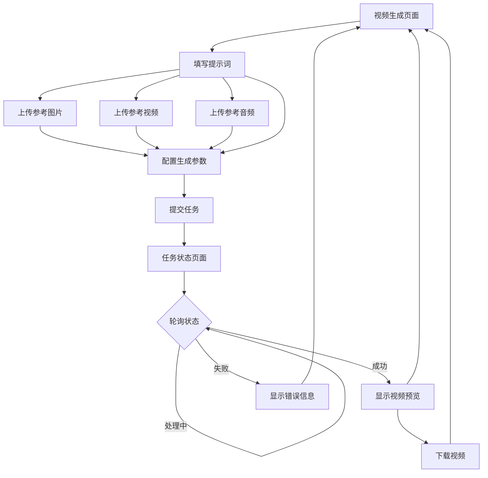

## 1. Product Overview

视频生成前端界面，允许用户通过表单输入提示词、上传参考图片、参考视频和参考音频，调用火山引擎视频生成 API 创建视频内容。

目标用户：需要快速生成营销视频、创意内容的创作者和营销人员。

## 2. Core Features

### 2.1 User Roles

| Role | Registration Method | Core Permissions |
|------|---------------------|------------------|
| 普通用户 | 无需注册，本地使用 | 可使用全部视频生成功能 |

### 2.2 Feature Module

视频生成前端包含以下主要页面：

1. **视频生成页面**: 提示词输入、参考文件上传、生成参数配置、任务提交。
2. **任务状态页面**: 任务进度查看、视频预览、下载功能。

### 2.3 Page Details

| Page Name | Module Name | Feature description |
|-----------|-------------|---------------------|
| 视频生成页面 | 提示词输入区 | 多行文本输入框，支持输入视频生成描述，提供示例提示词按钮。 |
| 视频生成页面 | 参考图片上传 | 支持上传 0-5 张参考图片，显示图片预览，支持删除已上传图片。 |
| 视频生成页面 | 参考视频上传 | 支持上传 0-1 个参考视频，显示视频预览，支持删除。 |
| 视频生成页面 | 参考音频上传 | 支持上传 0-1 个参考音频，显示音频文件名，支持删除。 |
| 视频生成页面 | 生成参数配置 | 选择视频比例(16:9/9:16/1:1)、设置视频时长(5-30秒)、是否生成音频开关。 |
| 视频生成页面 | 提交按钮 | 点击后提交任务，显示提交状态，成功后跳转任务状态页。 |
| 任务状态页面 | 任务信息展示 | 显示任务ID、提交时间、当前状态。 |
| 任务状态页面 | 进度轮询 | 自动轮询任务状态，实时更新进度。 |
| 任务状态页面 | 视频预览 | 任务完成后显示视频播放器，支持在线预览。 |
| 任务状态页面 | 下载功能 | 提供视频下载按钮，支持保存到本地。 |
| 任务状态页面 | 返回按钮 | 支持返回生成页面创建新任务。 |

## 3. Core Process

用户操作流程：

1. 用户进入视频生成页面
2. 在提示词输入框中填写视频描述
3. 可选：上传参考图片（最多5张）
4. 可选：上传参考视频（最多1个）
5. 可选：上传参考音频（最多1个）
6. 配置生成参数（比例、时长、是否生成音频）
7. 点击提交按钮
8. 系统调用 API 创建任务
9. 自动跳转任务状态页面
10. 页面自动轮询任务状态
11. 任务完成后显示视频预览和下载按钮
12. 用户可下载视频或返回创建新任务

## 4. User Interface Design

### 4.1 Design Style

- 主色调：深蓝色 (#1a1a2e) 作为背景，亮蓝色 (#4a9eff) 作为强调色
- 按钮样式：圆角矩形，主按钮使用渐变蓝色，悬停时有轻微放大效果
- 字体：系统默认无衬线字体，标题 24px，正文 14px，小字 12px
- 布局风格：卡片式布局，居中单列形式，最大宽度 800px
- 图标：使用 Lucide React 图标库，线条简洁风格

### 4.2 Page Design Overview

| Page Name | Module Name | UI Elements |
|-----------|-------------|-------------|
| 视频生成页面 | 提示词输入区 | 白色背景卡片，带标签"视频描述"，多行文本域，高度 150px，右下角字符计数，下方有"加载示例"按钮 |
| 视频生成页面 | 参考图片上传 | 虚线边框上传区域，支持拖拽上传，已上传图片以网格形式展示(每行3张)，每张图片带删除按钮 |
| 视频生成页面 | 参考视频上传 | 单文件上传区域，上传后显示视频缩略图和文件名，带删除按钮 |
| 视频生成页面 | 参考音频上传 | 单文件上传区域，上传后显示音频波形图标和文件名，带删除按钮 |
| 视频生成页面 | 生成参数配置 | 三列布局，比例选择使用图标按钮组(横向/竖向/方形)，时长使用数字输入框，音频开关使用 Toggle |
| 视频生成页面 | 提交按钮 | 全宽蓝色渐变按钮，带加载动画，禁用状态为灰色 |
| 任务状态页面 | 任务信息展示 | 顶部状态卡片，显示任务ID、状态标签(处理中/成功/失败)、进度条 |
| 任务状态页面 | 视频预览 | 居中视频播放器，原生 controls，下方显示视频信息(分辨率、时长) |
| 任务状态页面 | 下载功能 | 绿色下载按钮，带下载图标，点击后触发浏览器下载 |
| 任务状态页面 | 返回按钮 | 次要样式按钮，位于下载按钮旁 |

### 4.3 Responsiveness

- 桌面优先设计，最大宽度 800px 居中显示
- 移动端适配：上传区域改为单列布局，参数配置改为垂直堆叠
- 支持触摸交互：上传区域支持点击选择文件

## 5. File Upload Specifications

| File Type | Max Count | Max Size | Supported Formats |
|-----------|-----------|----------|-------------------|
| 参考图片 | 5 | 10MB | jpg, jpeg, png, webp |
| 参考视频 | 1 | 100MB | mp4, mov, webm |
| 参考音频 | 1 | 20MB | mp3, wav, m4a |
